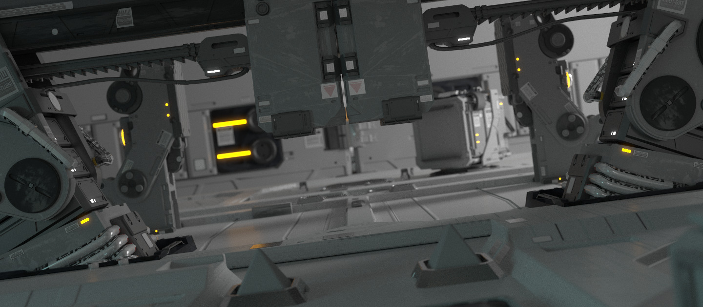

# 目录

1.  [简介]()
    * [逼真渲染和光线跟踪算法](Introduction/Photorealistic_Rendering_and_the_Ray-Tracing_Algorithm.md)
    * [基于物理的渲染简史](Introduction/A_Brief_History_of_Physically_Based_Rendering.md)
2.  [几何与变换]()
3.  [形状]()
4.  [图元和求交加速]()
5.  [颜色与辐射度量]()
6.  [相机类型]()
7.  [采样与重建]()
8.  [反射模型]()
9.  [材质]()
10. [纹理]()
11. [体积散射]()
12. [光源]()
13. [蒙特卡洛积分器]()
14. [光传输1：表面反射]()
15. [光传输2：体渲染]()
16. [光传输3：双向方法]()
17. [回顾与未来]()
